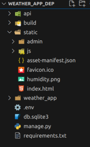
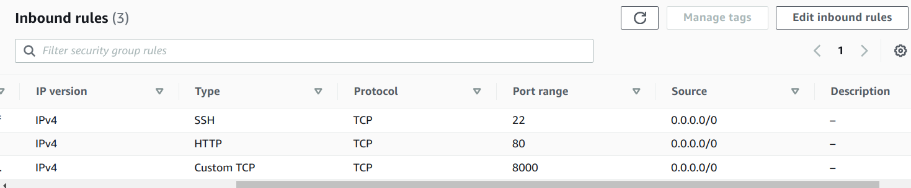

# weather_app

Built using React, Bootstrap, django frameworks

## Instructions to clone the repository
* You need to clone this repository into a desired folder 
```bash
git clone https://github.com/vishwa-s-a/weather_app.git
```

* Then
```bash
cd
```
## Instructions to run the backend
* Directions to execute 
1. To install the required dependencies and packages.
```bash
pip install -r requirements.txt
```
2. Start the django server(specific for Ubuntu 22.04).
```bash
python3 manage.py runserver
```
* You may face some issues as some confidential information and keys are stored in .env file and this is .env file is not commited to this repository
* 2 main keys are: 1. SECRET_KEY of django 2. API_KEY of openweathermap organization
* You can have the API_KEY by registering yourself on openweathermap.org for developer api's


## Instructions to run the frontend(open a new Terminal in same directory)
* Directions to execute 
you need to change directory to frontend by
```bash
cd frontend
```
1. Run npm install to get the required dependencies.
```bash
npm install
```
2. Runs the app in the development mode.<br>
Open [http://localhost:3000](http://localhost:3000) to view it in the browser.
```bash
npm start
```

### You may access this blog for further details on how to host this fullstack app on aws.
### By clicking this link [vishwa-s-a.blogspot.com](https://vishwa-s-a.blogspot.com/2023/09/test.html)

## Instructions to host React+django app where React makes API calls to Django

### abstract on how its done, detailed steps can be found below
* We are trying to host our full-stack project on aws ec2 instance running ubuntu, so accordingly commands are shown in this guide
* first we build the react project using 'npm run build' so it generates us the build folder then we copy this build folder to our backend folder then we run 'python3 manage.py collectstatic' so it generates a static folder and stores all our static files here. Then when we host our django app using gunicorn and apache2 server, we configure the apache2 server to point to this static files so we get our frontend, and also to act as reverse proxy for all api requests from frontend to our django app run on unix socket by gunicorn.Lets see all detailed steps

### Prerequisites
* You know the basics on how to create, use React projects and Django projects separately and to run there development server separately
* Have some basics on Linux commands, their syntax,usage.
* python3.x, pip, npm, nodejs other required packages as per your project
* Know to signup for aws services, create a aws ec2 instance (ubuntu os)

### Directory structure of my project

* here you won't find frontend folder or react project folder as this is my deployment version of the folder, instead of those I have static folder.
* here .env file is used for storing secret keys, api keys that shouldn't be publicly available
## Detailed guide
### Step1:
### Making all required changes in react project and django project to make it suitable for deployment
* you need to make changes in src,href(if required) of img,other html tag, as per your need
````
ex:
 

this was modified as

 
as our files are served from static folder by server in deployment stage
````
* In frontend part of the project change the urls where ever necessary if it is making a api call to backend
````
ex: 
fetch(`http://127.0.0.1:8000/api/${query}`)

this was modified as 

fetch(`http://a.b.c.d/api/${query}`)

note: here a.b.c.d is your server ip, so please update accordingly
````
* By now all necessary changes are made to our frontend project

### Step2:
### Building our react project 
* Run this command in folder where your React project was created
```bash
npm run build
```
* if this gives error, then check the path where this command was executed in terminal and accordingly use 'cd' command to reach your React project folder and then again run this command
* This will generate build folder in React project folder. 

### Step3:
### Copy this build folder to django project folder
* By now your React project is ready to be served by django. 
### Step4:
### Now you need to make some changes in django project folder here it is weather_app/ folder (which contains wsgi.py) accordingly identify yours
#### I request you to take a glance of the code then copy, modify to your needs, take chatgpt's help and get it right for your project. Don't get stuck
* add these lines of code to weather_app/settings.py. Adding doesn't mean you copy completely all lines, instead check your settings.py and if that part is not there then add, if there modify accordingly to your project needs.
* Mainly try to replace 'weather_app' with name of your folder, which contains wsgi.py(for reference)
* Try to replace 'weather_app_dep' to name of your folder, which contains manage.py(for reference)
```bash
ALLOWED_HOSTS = ['a.b.c.d','127.0.0.1','localhost']

TEMPLATES = [
    {
        'BACKEND': 'django.template.backends.django.DjangoTemplates',
        'DIRS': [os.path.join(BASE_DIR,'build')],
        'APP_DIRS': True,
        'OPTIONS': {
            'context_processors': [
                'django.template.context_processors.debug',
                'django.template.context_processors.request',
                'django.contrib.auth.context_processors.auth',
                'django.contrib.messages.context_processors.messages',
            ],
        },
    },
]

WSGI_APPLICATION = 'weather_app.wsgi.application'

# Static files (CSS, JavaScript, Images)
# https://docs.djangoproject.com/en/4.2/howto/static-files/

import os
STATIC_URL = '/static/'
STATIC_ROOT=os.path.join(BASE_DIR,'static')
STATICFILES_DIRS=[
    os.path.join(BASE_DIR,'build','static'),
    os.path.join(BASE_DIR,'build'),

]
```
* Here only modify a.b.c.d to your server ip and weather_app.wsgi.application to your django project's need accordingly

* Now add or modify weather_app/asgi.py with these code snippet lines
```bash
"""
ASGI config for weather_app project.

It exposes the ASGI callable as a module-level variable named ``application``.

For more information on this file, see
https://docs.djangoproject.com/en/4.2/howto/deployment/asgi/
"""

import os

from django.core.asgi import get_asgi_application

os.environ.setdefault('DJANGO_SETTINGS_MODULE', 'weather_app.settings')

application = get_asgi_application()
```
* now add or modify weather_app/urls.py with these lines of code
```bash
from . import views

urlpatterns = [
    ----Your code --------,
    
    -----Your code -------,
    path('',views.index,name="index"),
]
```
* now add or modify weather_app/views.py with these lines of code. If views.py doesn't exist then create
```bash
from django.views.generic import TemplateView
from django.views.decorators.cache import never_cache

index=never_cache(TemplateView.as_view(template_name='index.html'))
```

* now add or modify weather_app/wsgi.py with these lines of code
```bash
import os

from django.core.wsgi import get_wsgi_application

os.environ.setdefault('DJANGO_SETTINGS_MODULE', 'weather_app.settings')

application = get_wsgi_application()
```
### Step5:
### To collect all static files
* run this command in folder, where your manage.py is located 
```bash
python3 manage.py collectstatic
```
* If error occurs then create a folder named static and then run again the command
* This command is mean't for linux OS.

### Step6:
### To generate requirements.txt
* This file contains list of all python packages used in the project.
* first install pipreqs package which will do the above job

```bash
pip install pipreqs
```
* If you are already present in your project folder then run the below command or else navigate there and then run the command
```bash
pipreqs .
```
* This will generate requirements.txt, you can open and verify the contents
### Step7:
### Now to push this project or folder to a aws ec2 instance or any server
* Once check your static folder if inside this you find one more static folder then please delete that static folder, which was found inside.
* Push this code/folder or copy this code/project to your server
* Try to place this folder in users home folder like
/home/ubuntu
here ubuntu is user

### Step8:
### Installing all packages
* first install python and pip
```bash
sudo apt-get update
sudo apt install python3-pip python3 
``` 
* Then installing all packages required for project using requirements.txt
```bash
pip install -r requirements.txt
```

### Step9:
### Running Development server to check everything is correct
* First add port 8000 and 80 to inbound rules of your server(aws here)

* Then run this command
```bash
python3 manage.py runserver 0.0.0.0:8000
```
* Try to access http://a.b.c.d:8000 on your browser
* This should work fine and you should see your website/project on this website
* Then ctrl+c to stop the development server

### Step10:
### Installing apache2 and gunicorn
```bash
pip install gunicorn
sudo apt-get install apache2 libapache2-mod-wsgi-py3
```

### Step11:
### Now to use systemd to create a unix socket for incoming Gunicorn requests.
*  Below are configuration files and instructions

#### Let's create a system socket file for gunicorn now:
```bash
sudo nano /etc/systemd/system/gunicorn.socket
```
#### Paste the contents below and save the file
```bash
[Unit]
Description=gunicorn socket

[Socket]
ListenStream=/run/gunicorn.sock

[Install]
WantedBy=sockets.target
```
#### Next, we will create a service file for gunicorn
```bash
sudo nano /etc/systemd/system/gunicorn.service
```
#### Paste the contents below inside this file:
* here have a glance make changes accordingly to User,Group,WorkingDirectory,ExecStart.
* Mainly try to replace 'weather_app' with name of your folder, which contains wsgi.py(for reference)
* Try to replace 'weather_app_dep' to name of your folder, which contains manage.py(for reference)
* Let the User and Group be the same(optional)
```bash
[Unit]
Description=gunicorn daemon
Requires=gunicorn.socket
After=network.target

[Service]
User=ubuntu
Group=www-data
WorkingDirectory=/home/ubuntu/weather_app_dep
ExecStart=/home/ubuntu/.local/bin/gunicorn \
          --access-logfile - \
          --workers 3 \
          --bind unix:/run/gunicorn.sock \
          weather_app.wsgi:application

[Install]
WantedBy=multi-user.target
```
#### Lets now start and enable the gunicorn socket
```bash
sudo systemctl start gunicorn.socket
sudo systemctl enable gunicorn.socket
```

### Step12:
### Configuring Apache2 as a reverse proxy
#### Create a configuration file for Apache2 using the following command
```bash
sudo nano /etc/apache2/sites-available/000-default.conf
```
#### Paste the below contents inside the file created
* Mainly try to replace 'weather_app' with name of your folder, which contains wsgi.py(for reference)
* Try to replace 'weather_app_dep' to name of your folder, which contains manage.py(for reference)
```bash
<VirtualHost *:80>
        # The ServerName directive sets the request scheme, hostname and port that
        # the server uses to identify itself. This is used when creating
        # redirection URLs. In the context of virtual hosts, the ServerName
        # specifies what hostname must appear in the request's Host: header to
        # match this virtual host. For the default virtual host (this file) this
        # value is not decisive as it is used as a last resort host regardless.
        # However, you must set it for any further virtual host explicitly.
        #ServerName www.example.com

        ServerAdmin webmaster@localhost
        DocumentRoot /home/ubuntu/weather_app_dep


        # Available loglevels: trace8, ..., trace1, debug, info, notice, warn,
        # error, crit, alert, emerg.
        # It is also possible to configure the loglevel for particular
        # modules, e.g.
        #LogLevel info ssl:warn

        ErrorLog ${APACHE_LOG_DIR}/error.log
        CustomLog ${APACHE_LOG_DIR}/access.log combined


        Alias /static /home/ubuntu/weather_app_dep/static
        <Directory /home/ubuntu/weather_app_dep/static>
        Require all granted
        </Directory>

        <Directory /home/ubuntu/weather_app_dep/weather_app>
        <Files wsgi.py>
        Require all granted
        </Files>
        </Directory>

        WSGIDaemonProcess weather_app python-path=/home/ubuntu/weather_app_dep:/home/ubuntu/.local/lib/python3.10/site-packages
        WSGIProcessGroup weather_app
        WSGIScriptAlias / /home/ubuntu/weather_app_dep/weather_app/wsgi.py


         # Proxy dynamic API requests to Gunicorn backend via Unix socket
        ProxyPassMatch ^/api/(.*) unix:/run/gunicorn.sock|http://127.0.0.1/api/$1
        ProxyPassReverse /api/ http://127.0.0.1:8000/api/

        # For most configuration files from conf-available/, which are
        # enabled or disabled at a global level, it is possible to
        # include a line for only one particular virtual host. For example the
        # following line enables the CGI configuration for this host only
        # after it has been globally disabled with "a2disconf".
        #Include conf-available/serve-cgi-bin.conf
</VirtualHost>
```
#### Explaination of these two lines(so you can modify them according to your needs):
```
ProxyPassMatch ^/api/(.*) unix:/run/gunicorn.sock|http://127.0.0.1/api/$1
ProxyPassReverse /api/ http://127.0.0.1:8000/api/
```
* My frontend will make a api call to http://a.b.c.d/api/some_value ,then our apache2 acts as reverse proxy and sends this api request to gunicorn's unix socket
* Thats why we add this part to ProxyPassMatch to match the api url
> ^/api/(.*)
* Here $1 will store the value which is after /api/, in this example( http://a.b.c.d/api/some_value) $1 will store 'some_value' and sends it to django backend so accordingly other works can happen

#### Restart apach2 and allow the changes to take place.
```bash
sudo systemctl restart apache2
```
### Step13:
### Providing apache2 server with all required read/execute permission on your project directory and its parent directory
```bash
sudo chown -R www-data:www-data /home/ubuntu/weather_app_dep
sudo chown :www-data ~/weather_app_dep
sudo chmod 755 -R /home/ubuntu
```
### Now check for any errors in apache2 server by running 
```bash
sudo systemctl status apache2
```
### Now check for any errors in gunicorn socket by running 
```bash
sudo systemctl status gunicorn.service
```
### If You have followed all the above steps and didn't face any error or faced some but you solved those errors, then great job, Congratulation
### Finally go to ip address of your server on a browser to see your project(react+django)

